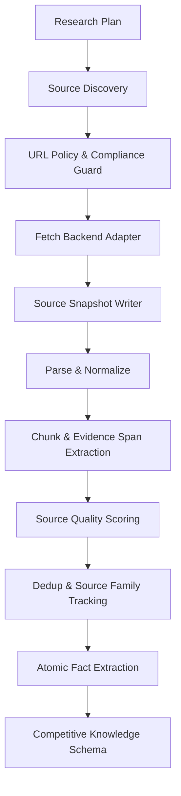

# RivalScope Source Tooling Design

## Purpose

Source Tooling is the acquisition layer that turns public competitor information
into auditable evidence assets.

The core goal is not "crawl web pages". The core goal is:

```text
public source -> frozen snapshot -> exact evidence span -> atomic fact
```

This layer decides whether RivalScope feels like a generic scraper plus LLM, or
like a trustworthy competitive intelligence system.

## Design Decision

Use an adapter-based acquisition layer.

Scrapling, Playwright, static HTTP fetchers, search APIs, enterprise crawlers,
or future third-party scraping services can all be plugged in as backend
implementations. None of them should become the domain model.

The canonical positioning is:

```text
Scrapling = optional Fetch / Parse backend
RivalScope Source Tooling = Evidence Acquisition System
```

RivalScope must own:

- source policy
- tool contracts
- immutable source snapshots
- evidence span extraction
- source quality scoring
- deduplication and source-family tracking
- ToolCall observability
- provenance links into the downstream DAG

## Why Not Treat Scrapling As The Whole Design

[Scrapling](https://github.com/D4Vinci/Scrapling) is useful because it provides
strong scraping primitives: HTTP, dynamic, and stealthy fetchers, a Spider API,
concurrent crawling, selector APIs, development cache behavior, optional
robots.txt support, browser rendering, adaptive element tracking, Docker, and
MCP support.

Those capabilities help with page acquisition and parsing. They do not solve
RivalScope's competition-critical problems:

- Which public sources are allowed?
- Was the exact source state frozen?
- Which exact sentence supports the claim?
- Is the source official, independent, stale, duplicated, or low quality?
- Can a final report claim be traced to source text?
- Did a role violate its artifact boundary?
- Did the Critic or TraceValidator catch unsupported output?
- Can evaluation measure citation precision and trace completeness?

Therefore Scrapling should be integrated behind a stable RivalScope tool
contract, not exposed as the system's core abstraction.

## Architecture



The Source Tooling layer must produce artifacts that later agents can trust,
inspect, score, and cite.

## P0 Tool Chain

### 1. `SourceDiscoveryTool`

Finds candidate sources for a competitor and dimension.

Inputs:

```ts
export interface SourceDiscoveryInput {
  projectId: string;
  competitorId: string;
  dimension: string;
  query: string;
  sourceTypes: SourceType[];
  maxResults: number;
}
```

Outputs:

```ts
export interface SourceCandidate {
  url: string;
  title?: string;
  snippet?: string;
  sourceType?: SourceType;
  discoveryMethod: "search_api" | "seed_url" | "sitemap" | "manual" | "agent_suggested";
  discoveredAt: string;
}
```

Discovery backends can include:

- manual seed URLs
- search API
- sitemap extraction
- known official pages
- docs pages
- pricing pages
- changelogs
- press releases
- review sources

### 2. `UrlPolicyGuard`

Decides whether a candidate source may be fetched.

Responsibilities:

- URL normalization.
- Domain allowlist / denylist.
- Private IP, localhost, and metadata IP blocking.
- Robots.txt policy.
- Crawl delay and rate limit policy.
- Content-type policy.
- Login/paywall/personal data filtering.
- Browser rendering permission.
- Stealth/proxy permission.
- Human override requirement.

Default policy:

```text
official docs / pricing / changelog / blog / public press release:
  allow

login-required / private dashboard / personal profile / leaked data:
  block

robots denied:
  block or require explicit human override

anti-bot bypass / CAPTCHA solving:
  default off
```

RivalScope should emphasize compliant public-source collection, not anti-bot
bypass.

### 3. `FetchUrlTool`

Fetches a URL through a backend adapter.

```ts
export type FetchMode = "static_http" | "dynamic_browser" | "scrapling";

export interface FetchUrlInput {
  url: string;
  mode: FetchMode;
  timeoutMs: number;
  maxBytes: number;
  respectRobotsTxt: boolean;
  renderJavascript: boolean;
  screenshot: boolean;
}

export interface FetchUrlOutput {
  finalUrl: string;
  statusCode?: number;
  contentType?: string;
  retrievedAt: string;
  rawHtml?: string;
  text?: string;
  markdown?: string;
  screenshotUri?: string;
  headers?: Record<string, string>;
  fetchBackend: string;
  fetchWarnings: string[];
}
```

Backend adapters:

```ts
export interface FetchBackend {
  name: string;
  fetch(input: FetchUrlInput): Promise<FetchUrlOutput>;
}
```

Recommended backend strategy:

- P0: `StaticHttpBackend` and optional `PlaywrightBackend`.
- P1: `ScraplingBackend` as an optional Python sidecar.
- P2: enterprise crawler, Browserbase, Firecrawl, Crawl4AI, or internal
  services if useful.

### 4. `SourceSnapshotWriter`

Freezes fetched content into an immutable snapshot.

```ts
export interface SourceSnapshot {
  snapshotId: string;
  sourceId: string;
  canonicalUrl: string;
  finalUrl: string;
  title?: string;
  publisher?: string;
  sourceType: SourceType;
  retrievedAt: string;
  publishedAt?: string;
  contentHash: string;
  rawStorageUri: string;
  textStorageUri: string;
  markdownStorageUri?: string;
  screenshotUri?: string;
  httpStatus?: number;
  contentType?: string;
  parserVersion: string;
  fetchBackend: "static_http" | "playwright" | "scrapling";
  toolCallId: string;
  agentRunId: string;
  policyDecisionId: string;
}
```

Rule:

```text
URL is not evidence.
Frozen SourceSnapshot is evidence.
```

Never overwrite snapshots. If source content changes, create a new snapshot.

### 5. `ParseDocumentTool`

Turns source snapshots into normalized documents.

```ts
export interface ParsedDocument {
  snapshotId: string;
  title?: string;
  mainText: string;
  markdown?: string;
  sections: ParsedSection[];
  tables: ParsedTable[];
  links: ParsedLink[];
  parseWarnings: string[];
  parserVersion: string;
}
```

Parsing must preserve enough location information to support later evidence
highlighting:

- section headings
- text offsets
- CSS selectors
- XPath selectors
- table row/column positions
- PDF page numbers
- screenshot regions when available

### 6. `ChunkDocumentTool`

Splits normalized documents into stable chunks.

Chunk IDs must be deterministic for the same snapshot and parser version.

Chunk metadata should include:

- snapshot id
- source id
- chunk ordinal
- heading path
- text offsets
- token estimate
- content hash
- parser version

### 7. `EvidenceSpanExtractor`

Extracts exact cited spans from parsed documents or chunks.

```ts
export interface EvidenceSpan {
  evidenceSpanId: string;
  snapshotId: string;
  sourceId: string;
  quote: string;
  normalizedText: string;
  location: {
    textOffsetStart?: number;
    textOffsetEnd?: number;
    cssSelector?: string;
    xpath?: string;
    tableId?: string;
    rowIndex?: number;
    columnIndex?: number;
    pageNumber?: number;
    boundingBox?: BoundingBox;
  };
  evidenceType:
    | "direct_text"
    | "table_cell"
    | "pricing_value"
    | "feature_list"
    | "quote"
    | "release_note";
  extractedByToolCallId: string;
  extractionConfidence: number;
}
```

The Extractor Agent may propose evidence spans, but the system must store exact
text, location, snapshot id, and tool call id. Later agents should cite
`evidenceSpanId`, not raw URLs.

### 8. `SourceQualityScorer`

Scores source reliability and usefulness.

```ts
export interface SourceQualityScore {
  sourceId: string;
  snapshotId: string;
  trustTier:
    | "official"
    | "primary"
    | "reputable_media"
    | "community"
    | "unknown"
    | "low_quality";
  sourceType: SourceType;
  independenceGroup: string;
  freshnessScore: number;
  authorityScore: number;
  relevanceScore: number;
  conflictRisk: number;
  qualityScore: number;
  rationale: string[];
}
```

Examples:

- Official pricing page: high authority, low independence, high freshness
  requirement.
- Third-party review: medium authority, higher independence, possible noise.
- News article: date-sensitive authority.
- Random blog: lower authority, requires corroboration.

This score feeds claim confidence, source independence, freshness fit, and
contradiction handling.

### 9. `DedupSourceTool`

Prevents repeated or syndicated content from faking source independence.

Track:

- canonical URL
- normalized URL without tracking params
- content hash
- near-duplicate hash
- publisher group
- source family
- language/locale variants

Five copies of the same press release should count as one source family, not
five independent confirmations.

## Scrapling Integration Plan

### Recommended Approach

Use Scrapling as an optional backend adapter.

```text
TypeScript Tool Contract
  -> ScraplingBackend
      -> Python sidecar service
          -> Scrapling fetch / parse
```

This keeps the TypeScript DAG, AgentRun, ToolCall, Artifact, and provenance
models stable even if the scraping backend changes.

### Why A Sidecar

The current project is a TypeScript monorepo. Scrapling is Python. A sidecar
keeps the boundary explicit:

- TypeScript owns tool contracts and artifacts.
- Python owns advanced scraping implementation.
- The API boundary is JSON.
- Scrapling can be replaced without rewriting agents.

### Possible Integration Modes

1. Python sidecar service.
   - Best long-term boundary.
   - Good for Docker and local dev.
   - Recommended for P1.

2. Docker command adapter.
   - Quick demo path.
   - Weaker observability and process control.

3. Direct MCP usage.
   - Useful for exploration.
   - Not recommended as the core production pipeline because RivalScope still
     needs deterministic tool contracts, artifact ids, and policy gates.

### Default Timing

Recommended:

```text
P0:
  TypeScript tool contracts
  Static HTTP fetch
  Playwright fallback
  SourceSnapshot
  EvidenceSpan

P1:
  ScraplingBackend sidecar
  adaptive selector support
  advanced dynamic page handling

P2:
  crawl budgets
  source freshness monitor
  snapshot diffs
  source family clustering
```

If the demo needs dynamic-page impact quickly, Scrapling can be pulled into P0,
but it must still sit behind `FetchBackend`.

## Tool Observability

Every Source Tooling step must write a `ToolCallRecord`:

```ts
export interface ToolCallRecord {
  id: string;
  workflowRunId: string;
  nodeId: string;
  agentRunId: string;
  toolName: string;
  inputArtifactIds: string[];
  outputArtifactIds: string[];
  startedAt: string;
  finishedAt?: string;
  status: "succeeded" | "failed" | "blocked" | "timed_out";
  sanitizedInput: unknown;
  sanitizedOutput?: unknown;
  errorMessage?: string;
  retryCount: number;
  durationMs?: number;
}
```

The UI should expose:

- source candidate list
- policy decision
- fetch backend
- HTTP status and warnings
- source snapshot metadata
- parsed text preview
- evidence span highlight
- source quality score
- duplicate/source-family status

## Security And Compliance

Source Tooling handles untrusted content. Minimum guardrails:

- Block private IPs, localhost, link-local addresses, and cloud metadata IPs.
- Enforce max response size.
- Enforce timeout.
- Restrict content types.
- Record redirects.
- Respect robots policy by default.
- Treat page text as data, never instruction.
- Do not execute page-provided prompts.
- Do not store secrets in tool inputs or outputs.
- Sanitize logged headers and query parameters.
- Default stealth/anti-bot bypass features to off.

Competition framing:

```text
RivalScope collects public evidence compliantly and audibly.
It is not positioned as an anti-bot bypass system.
```

## Evaluation Metrics

Source Tooling should be evaluated directly.

Metrics:

- `source_collection_coverage`: required source types found.
- `fetch_success_rate`: candidates successfully fetched.
- `policy_block_accuracy`: unsafe or disallowed URLs blocked.
- `snapshot_completeness`: required snapshot metadata present.
- `parse_quality`: main content extracted without navigation noise.
- `evidence_span_precision`: extracted spans actually support target facts.
- `evidence_span_recall`: gold evidence spans found.
- `source_quality_accuracy`: quality score agrees with labeled tier.
- `dedup_accuracy`: duplicated source families detected.
- `tool_observability_completeness`: every step has ToolCallRecord.

Seeded defects:

- URL points to localhost/private IP.
- Page contains prompt injection text.
- Pricing page is stale.
- Source is a duplicate press release.
- Evidence span mentions a feature but does not support the extracted fact.
- Wrong competitor page cited.
- Redirect changes source family.
- HTML parser captures navigation text as evidence.

## Implementation Shape

Suggested TypeScript layout:

```text
packages/tools/
  src/
    contracts/
      tool-definition.ts
      source-tooling.ts
    source/
      source-discovery-tool.ts
      url-policy-guard.ts
      fetch-url-tool.ts
      source-snapshot-writer.ts
      parse-document-tool.ts
      chunk-document-tool.ts
      evidence-span-extractor.ts
      source-quality-scorer.ts
      dedup-source-tool.ts
    backends/
      static-http-backend.ts
      playwright-backend.ts
      scrapling-backend.ts
```

Optional Scrapling sidecar:

```text
tools/scrapling-service/
  pyproject.toml
  src/
    server.py
    fetch.py
    parse.py
```

## P0 Acceptance Criteria

- A project can ingest at least one public source per competitor.
- Each fetched source becomes an immutable `SourceSnapshot`.
- Parsed documents preserve location information.
- Evidence spans cite exact snapshot locations.
- Extracted facts cite evidence span ids.
- Tool calls are persisted or otherwise inspectable.
- URL policy blocks private/local/internal addresses.
- Source content cannot become agent instruction.
- The workflow can run with offline fixture sources for tests.

## P1 Acceptance Criteria

- Scrapling can be enabled as a backend without changing agent code.
- Dynamic pages can be fetched through an adapter.
- Source quality scores feed claim confidence.
- Dedup/source-family logic prevents fake independence.
- The UI shows snapshot metadata and evidence highlights.

## Final Decision

Freeze this as the Source Tooling strategy:

```text
Adapter-Based Evidence Acquisition

Definition:
RivalScope uses interchangeable fetch and parse backends, including optional
Scrapling integration, but owns the evidence pipeline itself. Every public
source is passed through policy checks, fetched through an observable tool,
frozen as an immutable SourceSnapshot, parsed into location-preserving text,
converted into exact EvidenceSpans, scored for source quality, deduplicated by
source family, and only then used for AtomicFacts, Claims, confidence scoring,
provenance, and evaluation.
```
